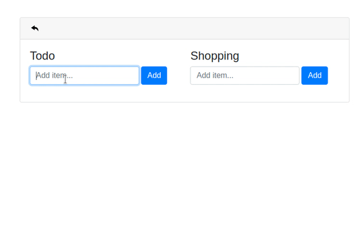

# ngxs-history-plugin demo

This demo application uses [ngxs](https://www.ngxs.io/), has two state slices, and implements the **ngxs-history-plugin**.
The state slices are the _todo_ and the _shopping_.

## Install

See [here](projects/ngxs-history-plugin/README.md) instructions of how to install the **ngxs-history-plugin**
